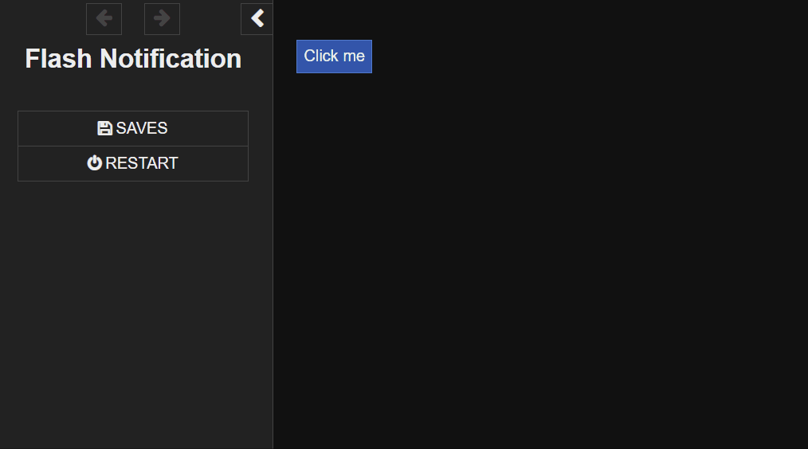
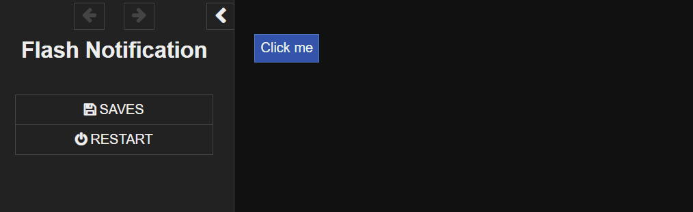

# Flash

Advanced notification system with 16 optional settings and 2 global settings.

## Installation

Please check your SugarCube version and use the appropriate folder for the next steps!

If using the Twine desktop/web app, copy contents of `flash.js` to the `Story JavaScript` section, and copy contents of `flash.css` to the `Story Stylesheet` section.

If using a compiler like Tweego, drop `flash.js` and `flash.css` to your source folder.

The `.js` and `.css` are also available in a `.min` form, so it takes up less space.

## Example Usage

The following example uses the default values of flash.

```html
<<flash "You found Maxine!">>
<</flash>>
```

---

## Usage - Flash arguments

1. 'Flash' has sixteen (yes 16) arguments which allow things to be customized for your desire. I recommend staying away from 7, and 10 to and including 14, unless you know what you're doing.
    - [Input text](#Text), there is no default, this must be user provided. (Argument 1)
    - [Type](#Type), default is `default`, (Argument 2)
    - [Progress](#Progress), default is `true` (Argument 3)
    - [Interactive](#Interactive), default is `true`. (Argument 4)
    - [Timeout](#Timeout), default is `8000`ms. (Argument 5)
    - [Delay](#Delay), default is `200`ms. (Argument 6)
    - [Container](#Container), default is `.flash-container`. (Argument 7)
    - [Theme](#Theme), default is `default`. (Argument 8)
    - [Layout](#Layout), default is `top-right`. (Argument 9)
    - [Container Class](#ContainerClass), default is `flash-container`. (Argument 10)
    - [Flash Class](#FlashClass), default is `flash-message`. (Argument 11)
    - [Visible Class](#VisibleClass), default is `is-visible`. (Argument 12)
    - [Progress Class](#ProgressClass), default is `flash-progress`. (Argument 13)
    - [Hidden Class](#HiddenClass), default is `is-hidden`. (Argument 14)
    - [Transition](#Transition), default is `false`. (Argument 15)
    - [Thumb](#Thumb), default is `empty`. (Argument 16)
    - [Styling example](#Styling), an example of styling of the `css` itself, this is not the recommended way of doing this.
2. 'Flash' Can accept custom types (before you had to insert a custom type, this is no longer the case).
    - [Inserting new type](#TypeInsert), No longer supported, merged automatically with Argument 2.
    - [Using new Type](#Type), refer to Argument 2 for usage.
    - [Important styling](#StylingType), if you want to have custom styling, please copy and edit the `css` found here. Take a look at the example.
3. 'Flash' can also be called directly through javascript
    - [Javascript methods](#Javascript), here you can find a way to fully control and customize everything. **NOT** recommended for authors without knowledge of JavaScript.
4. 'Flash' has two global settings, a maximum allowed flashes at the same time and a debug mode for console messages.
    - [Limitation](#Limitation), here you can find how to limit the maximum amount of flashes at the same time.
    - [Debug](#Debug), debugging messages in the console to check what is happening while flashes are generated.


**Argument placement:**
(You can cherry pick which arguments to use)
```html
<<flash Argument1>>
    <<flashType Argument2>>
    <<Progress Argument3>>
    <<Interactive Argument4>>
    <<Timeout Argument5>>
    <<Delay Argument6>>
    <<Container Argument7>>
    <<Theme Argument8>>
    <<Layout Argument9>>
    <<classContainer Argument10>>
    <<classFlash Argument11>>
    <<classVisible Argument12>>
    <<classProgress Argument13>>
    <<classHidden Argument14>>
    <<Transition Argument15>>
    <<Thumb Argument16>>
<</flash>>
```

**Example:**

```html
<<flash "Ew, a nasty bug has been found">>
    <<flashType "bug">>
    <<Timeout 6000>>
    <<Delay 1000>>
    <<Theme "dark">>
<</flash>>
```

---

## Text

- `Argument1`: *(string)* text.

1. 'Flash' has no default, user must submit a string with text.
    - Only UTF-8 is accepted.
    - Must be user supplied.
    - Flash accepts `$var` and math, for example, `$x + $y`.

## Type

- `Argument2`: *(string)* flash type.

1. 'flash' has a default flash type set to `default`.
    - Only string are accepted.
    - The following default strings are accepted: `success`, `warning`, `error`, `info`, `bug`, `disabled`, `default`.
    - If inserting a custom type, for example `wizardry` be sure to check [Important styling](#StylingType).

## Progress

- `Argument3`: *(boolean)* progress bar and whether the notification dissappears on its own. 

1. 'flash' has a default progress set to `true`.
    - Only booleans are accepted.
    - Setting this to `false` will cause the notification to permanently stay unless click if `interactive = true`.
    - If combined with [a global limitation](#Limitation), please note that mixing `true` and `false` flashes could cause queued flashes to never display, thus bugging out. 

## Interactive

- `Argument4`: *(boolean)* interaction.

1. 'flash' has a default interaction set to `true`.
    - Only booleans are accepted.
    - Setting this to `false` will block people from dismissing the notification through clicking.

## Timeout

- `Argument5`: *(integer)* time-out in milliseconds.

1. 'flash' has a default time-out set to `8000`ms or `8`s.
    - Only integers are accepted.
    - Minimum will be `500` or an error will be thrown.
    - Maximum will be `100000` or an error will be thrown.

## Delay

- `Argument6`: *(integer)* delay in milliseconds.

1. 'flash' has a default delay set to `200`ms or `0.2`s.
    - Only integers are accepted.
    - Minimum will be `50` or an error will be thrown.
    - Maximum will be `100000` or an error will be thrown.

## Container

- `Argument7`: *(string)* flash container.

1. 'flash' has a default container set to `.flash-container`.
    - Only strings are accepted.

**NOTE:** The element must exist before the macro is called.

## Theme

- `Argument8`: *(string)* theme.

1. 'flash' has a default theme set to `default`.
    - Only string are accepted.
    - The following strings are accepted: `dark`, `default`.

## Layout

- `Argument9`: *(string)* layout.

1. 'flash' has a default layout set to `top-right`.
    - Only string are accepted.
    - The following strings are accepted: `top-right`, `middle-right`, `bottom-right`, `middle-bottom`, `bottom-left`, `middle-left`, `top-left`, `middle-top`.
    - When a container is made, this can not be changed dynamically, wait for the container to be destroyed to change to a new layout.

## ContainerClass

- `Argument10`: *(string)* flash container class.

1. 'flash' has a default flash container class set to `.flash-container`.
    - Only string are accepted.
    - Please place a `.` or `#` in the argument to imply whether the custom container is selected through an ID or Class.
    - The container is automatically removed after usage. This is expected behaviour because the container should also be dynamically made right before the macro call. This is because the element **must** exist. I recommend pairing it with a widget to create the container, and right after call the macro. 

**NOTE:** This breaks ALL existing `css` rules. Thus, the user must supply their own.

## FlashClass

- `Argument11`: *(string)* flash class.

1. 'flash' has a default flash class set to `flash-message`.
    - Only string are accepted.

**NOTE:** This breaks ALL existing `css` rules. Thus, the user must supply their own.

## VisibleClass

- `Argument12`: *(string)* flash visible class.

1. 'flash' has a default flash visible class set to `is-visible`.
    - Only string are accepted.

**NOTE:** This breaks ALL existing `css` rules. Thus, the user must supply their own.

## ProgressClass

- `Argument13`: *(string)* flash progress class.

1. 'flash' has a default flash progress class set to `flash-progress`.
    - Only string are accepted.

**NOTE:** This breaks ALL existing `css` rules. Thus, the user must supply their own.

## HiddenClass

- `Argument14`: *(string)* flash progress hidden class.

1. 'flash' has a default flash progress hidden class set to `is-hidden`.
    - Only string are accepted.

**NOTE:** This breaks ALL existing `css` rules. Thus, the user must supply their own.

## Transition

- `Argument15`: *(boolean)* transition container removal.

1. 'flash' has a default transition container removal set to `false`.
    - Only booleans are accepted.
    - If set to `true` flash removes its container upon passage transition. To explain it more simple: when a player clicks a link, the flash message stays until its timer runs out or until it's clicked. If this argument is set to `true`, the messages get removed when a player clicks a link.

## Thumb

- `Argument16`: *(string)* creates an image.

1. 'flash' can create `` within the flash body.
    - Only strings are accepted.
    - Can be styled with the class `.flash-thumb`.
    - Parent (the container) can be styled with the class `.flash-message-has-thumb`.
    - ` [img[url]]` is not accepted (maybe some day).

## TypeInsert

1. `NO LONGER SUPPORTED`: custom types are now directly useable from argument 2.

## StylingType

1. `Story Stylesheet`: *(strings)*'s to make sure your newly added type actually does something we **must** give it custom styling. Please edit 'Wizardry' with your own custom name(s).

    - ```css
      /* Place the css below in your story stylesheet PLEASE PICK THE CORRECT VERSION FOR THE CONTENT!*/
      .flash-container .flash-message.flash-wizardry .flash-progress {
          /* Progress bar color */
          background-color: rgba(255, 153, 0, 0.15);
      }
      .flash-container .flash-message.flash-wizardry:before {
          /* Left line color */
          background-color: #ffcc00;
      }
      .flash-container .flash-message.flash-wizardry:after {
          /* Icon color */
          color: rgba(255, 179, 0, 0.5);
          /* Icon from tme-fa-icons VERSION 2.36 */
          content: '\e83a';
          /* Icon from tme-fa-icons VERSION 2.37 */
          content: '\f0d0';
          /* Change this if you want to use font-awesome icons or something else */
          font-family: "tme-fa-icons";
      }
      ```
    - ```html
      /* Place the macro in the passage you want to use it in */
      <<flash "The wizard of SugarCube">>
        <<flashType "wizardry">>
      <</flash>>
      ```



## Styling

1. 'flash' uses a nested `<div></div>` as output.
    - `<div class="flash-container"></div>`: *(class)*.

**Example:**

```css
.flash-container {
    z-index: 1000;
    max-width: 50%;
    position: fixed;
}
.flash-message {
    border: double 10px;
    color: red;
}
```
**NOTE:** It's not recommended to touch anything out of the VARIABLE theme settings.


## Javascript

1. This is how to use JavaScript to create flash messages with the default parameters.
    - ```js
      new FlashMessageManager(
          /* Text to be displayed. */
          'Lorem ipsum dolor sit amet, consectetur adipiscing elit.',
          /* Other Settings */
          {
          type: bug,
          progress: true,
          interactive: true,
          timeout: 8000,
          appear_delay: 200,
          container: '.flash-container',
          theme: 'default',
          layout: 'top-right',
          classes: {
              container: 'flash-container',
              flash: 'flash-message',
              visible: 'flash-is-visible',
              progress: 'flash-progress',
              progress_hidden: 'flash-is-hidden'
          }
      });
      ```

2. To quickly test in your SugarCube project, insert:
    - ```html
        <<button "JS Flash!">>
            <<script>>
                new FlashMessageManager(
                    'This example contributed by LeahPeach c:',
                    {
                    type: "bug"
                    progress: true,
                    interactive: true,
                    timeout: 8000,
                    appear_delay: 200,
                    container: '.flash-container',
                    theme: 'default',
                    layout: 'top-right',
                    classes: {
                        container: 'flash-container',
                        flash: 'flash-message',
                        visible: 'flash-is-visible',
                        progress: 'flash-progress',
                        progress_hidden: 'flash-is-hidden'
                    }
                });
            <</script>>
        <</button>>
        ```

## Limitation

1. `StoryInit`: *(integer)* to set a limit on the messages to display. Flash will queue messages when the limit has been reached. Place the following in `StoryInit`:
    - `<<run FlashMessageManager.DEFAULT_OPTIONS.limit = x>>` -> `x` is the maximum, the `default` is `0`, which means unlimited.
    - Theoretically this setting can be changed everywhere within a story, but, if doing this, there is a high chance of weirdness.

## Debug

1. `StoryInit`: *(boolean)* to activate debugging mode, so you can see what is happening. Place the following in `StoryInit`:
    - `<<run FlashMessageManager.DEFAULT_OPTIONS.debug = x>>` -> `x` is either `true` to display them in console, or `false` (default) to not generate them.
    - Theoretically this setting can be changed everywhere within a story, but, if doing this, there is a high chance of weirdness.