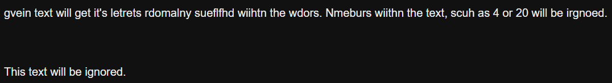

# custom-macros-sugarcube2

Small macros for Twine, SugarCube 2

## Installation

Download this repository and pick which macros you need. Each macro comes with a `README.md` which has further instructions on installation and usage.

## Macro sets

1. [Dyslexia](./Dyslexia)  
    - Simulate what dyslexia feels like to players/user.  
    - Customizable:
        - Word size, the minimum amount of letters a word needs to be changed
        - Chance, the minimum chance a word has to have letters switched
        - Delay, the delay per interval for words to change in milliseconds
        

2. [Spoiler](./Spoiler)
    - Hides words behind a blur.
    - Customizable:
        - Initial blur, the amount of blur in pixels.
        - Hover over blur, the amount of blur in pixels when hovering over the blurred text.
        - Hint text, help the player by hinting them to press or show another message you like.

