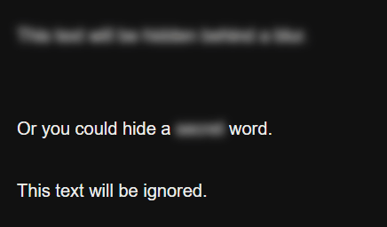
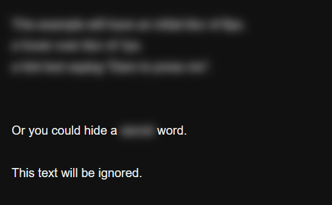
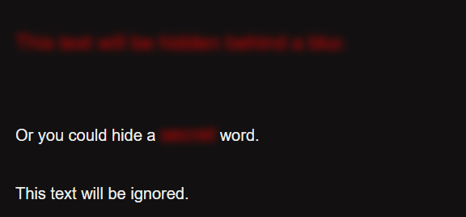

# Dyslexia

Hide words behind a blur with a hover over effect, reveal them by clicking words.

## Installation

If using the Twine desktop/web app, copy contents of `spoiler.js` to the `Story JavaScript` section.

If using a compiler like Tweego, drop `spoiler.js` to your source folder.

## Example Usage

The following example uses the default values of spoiler.

```html
<<spoiler>>
    This text will be hidden behind a blur.
<</spoiler>>

Or you could hide a <<spoiler>>secret<</spoiler>> word.
```

---

## Usage - Spoiler arguments

1. 'Spoiler' has three arguments which allow things to be customized for your desire.
    - [Initial blur effect](#Initial-blur), default is 4px blur. (Argument1)
    - [Hover over blur effect](#Hover-blur), default is 2px blur. (Argument2)
    - [Hint text](#Hint-text), default is `Click to reveal completely`. (Argument3)

**Argument placement:**

```html
<<spoiler Argument1 Argument2 "Argument3">>
    any text given.
<</spoiler>>
```

**Example:**

```html
<<spoiler 6 1 "Dare to press me">>
    This example will have an initial blur of 6px.
    a hover over blur of 1px.
    a hint text saying "Dare to press me".
<</spoiler>>

Or you could hide a <<spoiler 6 1 "Dare to press me">>secret<</spoiler>> word.
```

---

## Initial blur

- `Argument1`: *(integer)* blur in pixels.

1. 'Spoiler' has a default initial blur set to `4px`.
    - Only integers are accepted.
    - Minimum will be `1px` or an error will be thrown.
    - Maximum will be `10px` or an error will be thrown.

**NOTE:** Blurs with a greater value then 10 will be impossible to use.

## Hover blur

- `Argument2`: *(integer)* blur in pixels.

1. 'Spoiler' has a default hover over blur set to `2px`.
    - Only integers are accepted.
    - Minimum will be `1px` or an error will be thrown.
    - Maximum will be `10px` or an error will be thrown.

**NOTE:** Blurs with a greater value then 10 will be impossible to use.

## Hint text

- `Argument3`: *(string)* hover over text.

1. 'Spoiler' has a default hover over text stating `Click to reveal completely`.
    - Only string are accepted. Use quotation.
    - The string `null` won't be accepted and will be replaced with the default.
    - Using `Argument3` without quotation is possible, but only the first word gets read.

**NOTE:** leaving the string empty, `""`, will result in no hint text. 

## Styling

1. 'Spoiler' uses a `<span></span>` as output.
    - `<span class="macro-spoiler" />`: *(class)*.

**Example:**

```css
.macro-spoiler {
    font-size: 20px;
    color: red;
}
```
